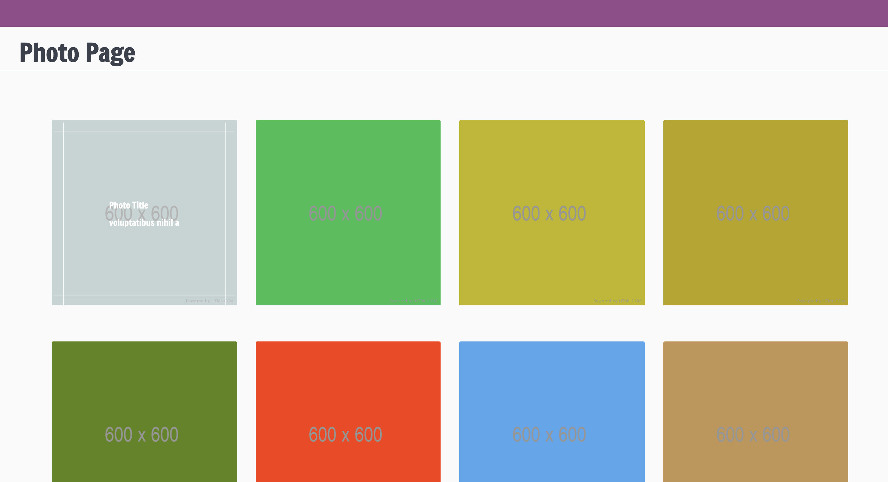

# Photo-App
This is a frontEnd application that allows inidivduals to view albums and photos




# Table of Contents

- [Getting Started](#getting-started)
- [Technology Stack](#technology-stack)
- [Installation](#installation)
- [Testing](#testing)
- [Questions](#questions)
- [Support or Contribution](#support-or-contribution)
- [Status](#status)

## Getting Started
This is a clientside javascript application built [React JS](https://reactjs.org/) application. The data exists on endpoints serve through [JSONPlaceholder API](https://jsonplaceholder.typicode.com/)


## Technology Stack

**Client Side**
1. Docker
2. React JS


## Installation

1. Install [**Node JS**](https://nodejs.org/en/).

2. Clone the [**repository here**](https://github.com/benfluleck/photo-album-app.git)
3. [**cd**] into the root of the **project directory**.
4. Run `npm run install` on the terminal to install project dependecies

5. Start the application:

**_Different Build Environments_**

**Docker**
- To run the application in docker you will need to install Docker.
There are some good docs [here](https://docs.docker.com/)


- To build the application and run Docker
`docker build -t photo-album .`

- To run the application
`docker run photo-album-docker -p 8000:80`

- Navigate to `http://localhost:8000`

### For Client
**Development**
```
npm run client:dev
```
- Navigate to `http://localhost:8000`


## StyleGuide

I have implemented react-style guide which helped with developing my UI components as I feel these are essential on any project.

You can launch this with `npm run styleguide`

Navigate to `http://localhost:6060`

UI Implementation is done using the [Atomic Design Pattern](http://atomicdesign.bradfrost.com/chapter-2/)

## Testing

Client side tests - Run `npm run client:test` on the terminal while within the **project root directory**.

Client side testing is achieved through the use of `jest` package. `jest` is used to test javascript code in
React applications.

Client side testing is yet to be configured but is being worked on currently

## Questions
For more details contact benny.ogidan@andela.com

## Support or Contribution
For any suggestions or contributions or issues please do raise them or email me.
For **Contributiions**, Please clone the repo and implement a PR I would appreciate it

## Status
Still undergoing testing
